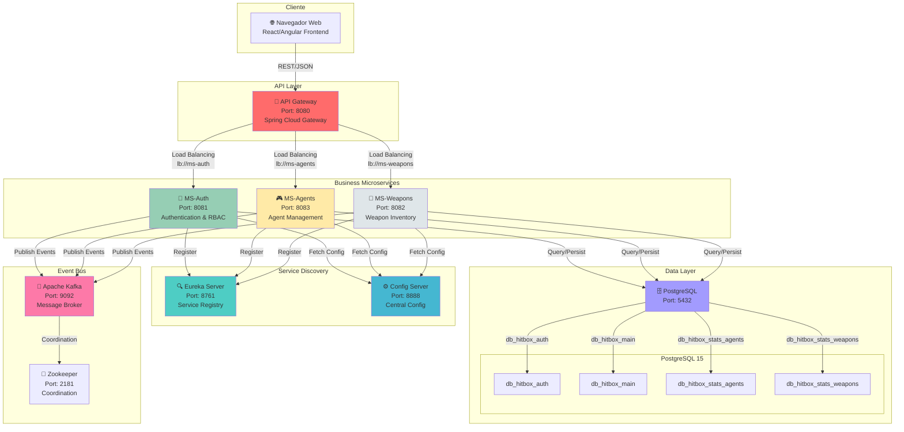
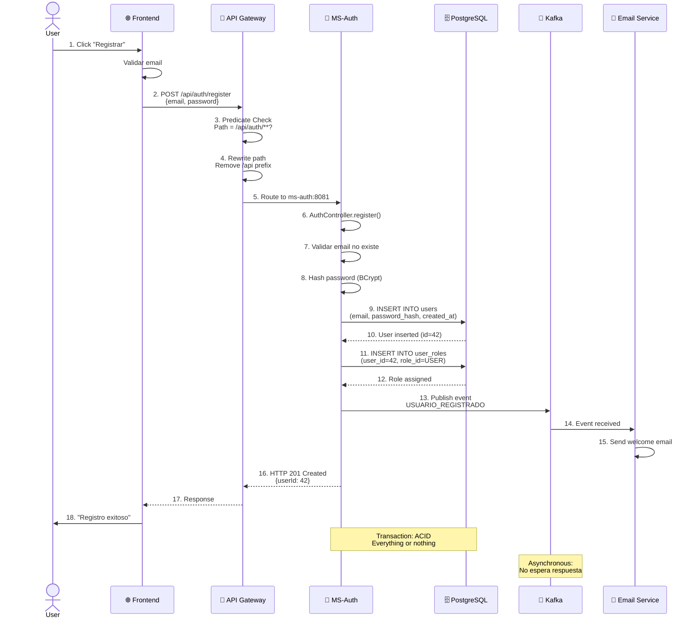
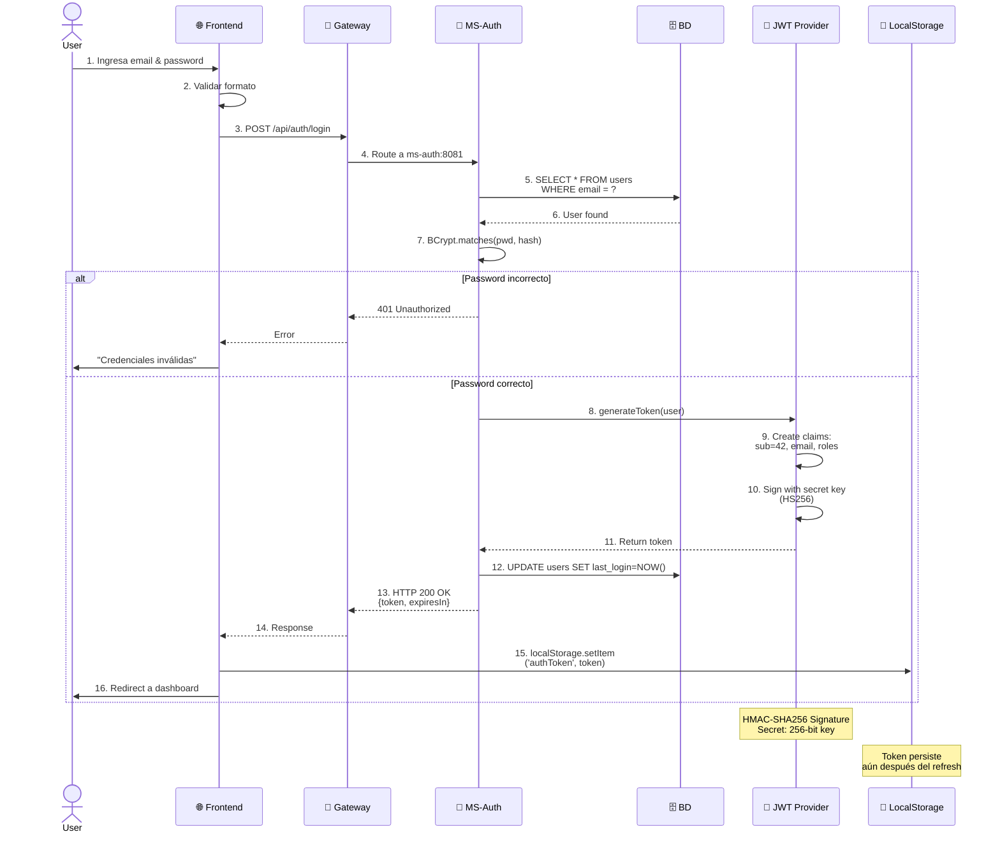
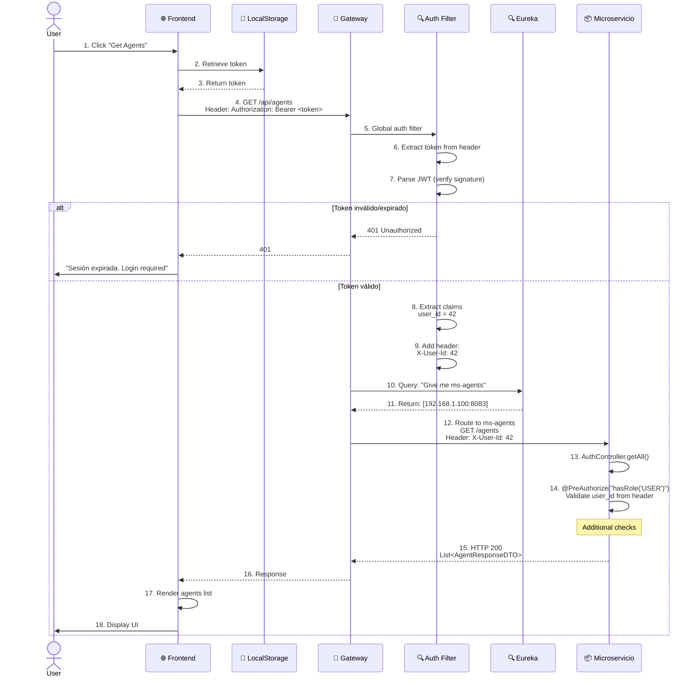
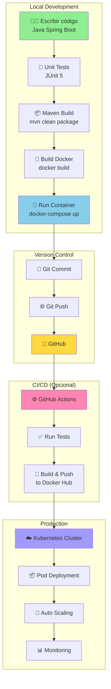
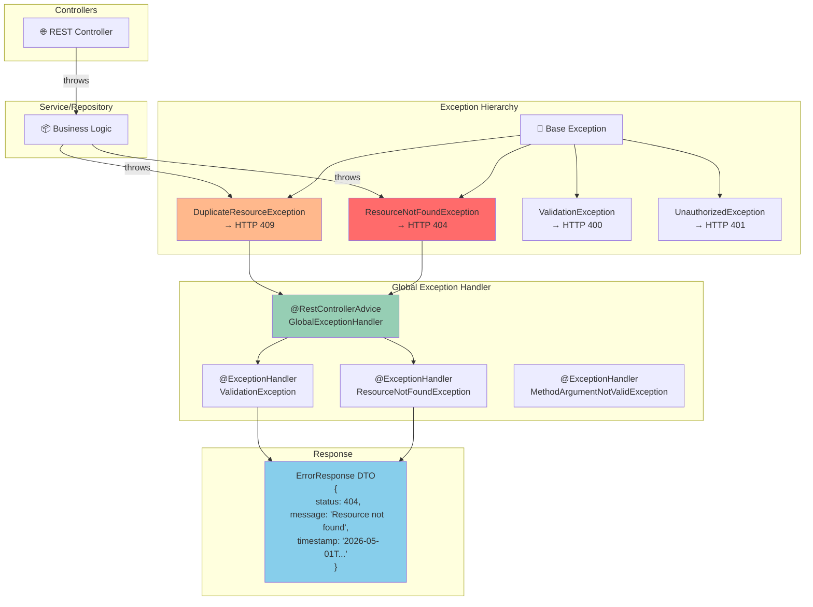
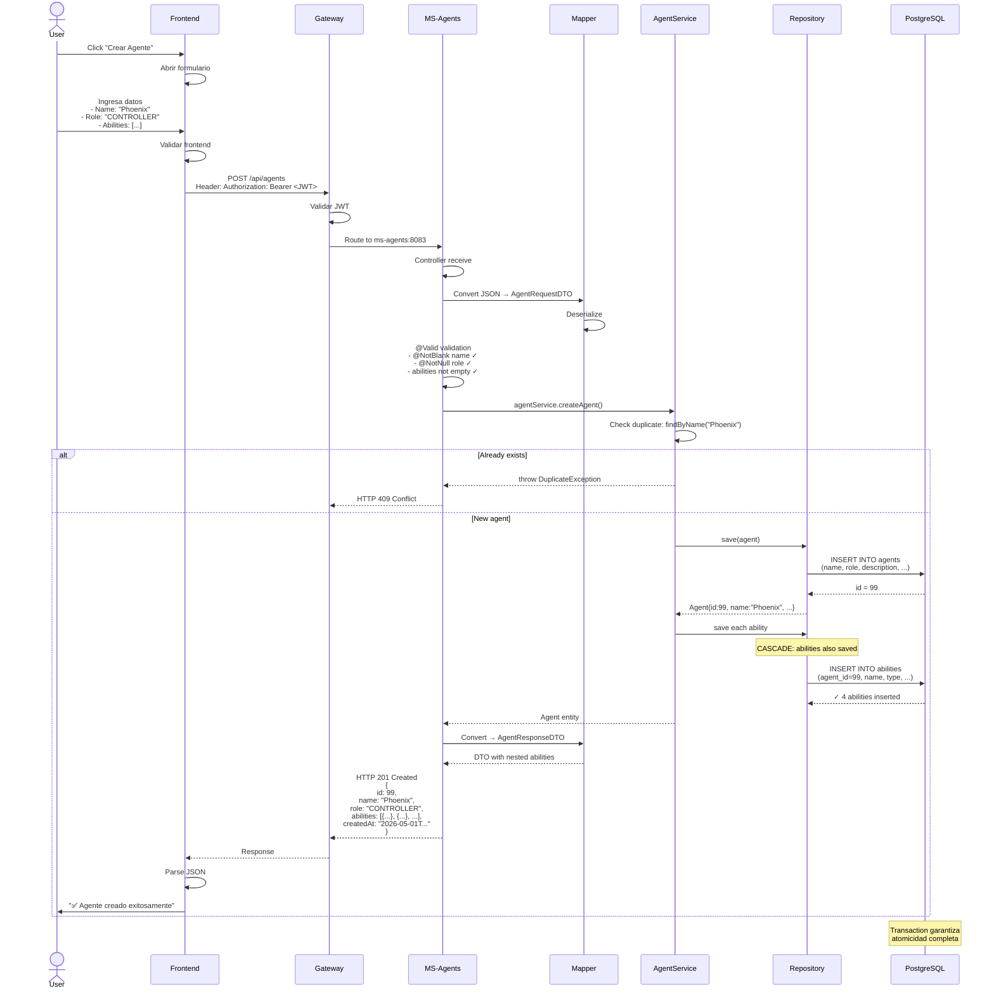
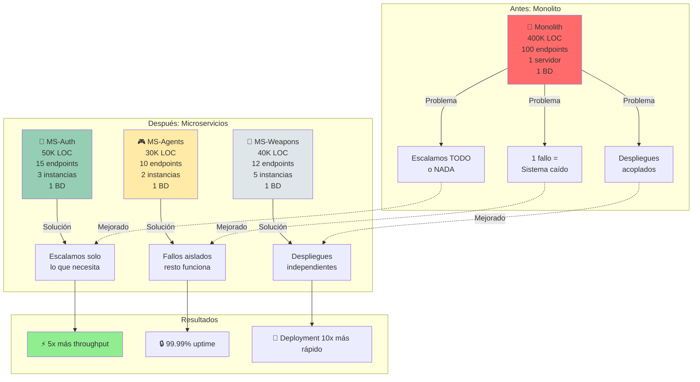
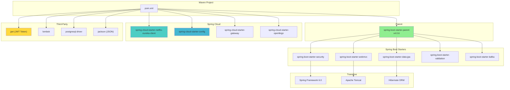

# 📊 DIAGRAMAS ARQUITECTÓNICOS DETALLADOS

## PROYECTO HITBOXKING

---

## 1. DIAGRAMA DE TOPOLOGÍA GENERAL



---

## 2. FLUJO DE REGISTRO E AUTENTICACIÓN



---

## 3. FLUJO DE LOGIN Y GENERACIÓN JWT



---

## 4. FLUJO DE SOLICITUD AUTENTICADA



---

## 5. CICLO DE VIDA DE UN AGENTE (CRUD)

```mermaid
graph LR
    subgraph "CREATE"
        C1["POST /api/agents"]
        C2["RequestDTO validation"]
        C3["Hash password if needed"]
        C4["INSERT INTO agents"]
        C5["INSERT INTO abilities"]
        C6["HTTP 201 Created"]

        C1 --> C2
        C2 --> C3
        C3 --> C4
        C4 --> C5
        C5 --> C6
    end

    subgraph "READ"
        R1["GET /api/agents"]
        R2["SELECT * FROM agents"]
        R3["Map Entity to DTO"]
        R4["HTTP 200 + JSON"]

        R1 --> R2
        R2 --> R3
        R3 --> R4
    end

    subgraph "UPDATE"
        U1["PUT /api/agents/{id}"]
        U2["Find agent by ID"]
        U3["Update fields"]
        U4["UPDATE agents SET..."]
        U5["HTTP 200 OK"]

        U1 --> U2
        U2 --> U3
        U3 --> U4
        U4 --> U5
    end

    subgraph "DELETE"
        D1["DELETE /api/agents/{id}"]
        D2["Find agent by ID"]
        D3["DELETE FROM abilities WHERE agent_id"]
        D4["DELETE FROM agents"]
        D5["HTTP 204 No Content"]

        D1 --> D2
        D2 --> D3
        D3 --> D4
        D4 --> D5
    end

    C6 --> R1
    R4 --> U1
    U5 --> D1

    style C6 fill:#90EE90
    style R4 fill:#87CEEB
    style U5 fill:#FFD700
    style D5 fill:#FF6B6B
```



---

## 6. ARQUITECTURA MULTICAPA DE MS-AGENTS

```mermaid
graph TB
    subgraph "Controller Layer"
        CR["🌐 AgentController<br/>@RestController<br/>@RequestMapping('/api/agents')"]
    end

    subgraph "DTO & Validation"
        DTO["📋 AgentRequestDTO<br/>@NotBlank, @NotNull<br/>Bean Validation"]
        MAPPER["🔄 AgentMapper<br/>Entity ↔ DTO"]
    end

    subgraph "Business Logic"
        SI["📦 AgentService (Interface)"]
        SIM["📦 AgentServiceImpl<br/>Core Logic:<br/>- Validations<br/>- Business rules<br/>- Exception handling"]
    end

    subgraph "Data Access"
        REPO["🗄️ AgentRepository<br/>extends JpaRepository<br/>- findById<br/>- findAll<br/>- save, delete"]
    end

    subgraph "Domain Model"
        ENT["📊 Agent (Entity)<br/>@Entity<br/>@Table(agents)"]
        ENUM["🎭 AgentRole<br/>DUELIST, CONTROLLER<br/>SENTINEL, INITIATOR"]
        AB["📊 Ability (Entity)<br/>@Entity<br/>@Table(abilities)"]
    end

    subgraph "Database"
        SQL["🗄️ PostgreSQL<br/>Port: 5432<br/>db_hitbox_stats_agents"]
        T1["Table: agents<br/>(id, name, role, ...)"]
        T2["Table: abilities<br/>(id, agent_id, name, ...)"]
    end

    CR -->|@Valid| DTO
    DTO -->|convert| MAPPER
    MAPPER -->|toEntity| SIM

    CR -->|@Autowired| SI
    SI -->|implements| SIM

    SIM -->|@Autowired| REPO
    REPO -->|JPA| ENT

    ENT --> ENUM
    ENT -->|@OneToMany| AB

    REPO -->|SQL Queries| SQL
    SQL --> T1
    SQL --> T2

    style CR fill:#FF6B6B
    style DTO fill:#FFD93D
    style SIM fill:#96CEB4
    style REPO fill:#6C5CE7
    style ENT fill:#A29BFE
    style SQL fill:#74B9FF
```

---

## 7. FLUJO KAFKA: EVENTO USUARIO AUTENTICADO

```mermaid
graph LR
    subgraph "Producer"
        P1["🔐 MS-Auth"]
        P2["AuthService.authenticate()"]
        P3["✅ Credenciales válidas"]
        P4["📨 Publish event<br/>usuario.autenticado"]

        P1 --> P2
        P2 --> P3
        P3 --> P4
    end

    subgraph "Message Broker"
        KB["Apache Kafka"]
        T["Topic: usuario.autenticado<br/>Partitions: 3<br/>Replication Factor: 1"]

        KB --> T
    end

    subgraph "Consumers"
        C1["📧 Email Service<br/>@KafkaListener<br/>Send welcome email"]
        C2["📊 Analytics<br/>Increment login counter"]
        C3["🎮 Recommendation Engine<br/>Load user preferences"]
        C4["🔔 Notification Service<br/>Create notification"]

        T --> C1
        T --> C2
        T --> C3
        T --> C4
    end

    P4 --> KB

    note over KB: Asynchronous Processing<br/>No esperar respuestas<br/>Eventual Consistency

    style P3 fill:#90EE90
    style T fill:#FFD93D
    style C1 fill:#74B9FF
    style C2 fill:#A29BFE
    style C3 fill:#FF85B3
    style C4 fill:#FFB88C
```

---

## 8. MODELO DE DATOS: AGENTS & ABILITIES

```mermaid
erDiagram
    AGENTS ||--o{ ABILITIES : contains

    AGENTS {
        BIGSERIAL id PK
        string name UK "UNIQUE"
        string role "ENUM: DUELIST, CONTROLLER, SENTINEL, INITIATOR"
        text description
        string image_url
        timestamp created_at "DEFAULT NOW()"
        timestamp updated_at "DEFAULT NOW()"
    }

    ABILITIES {
        BIGSERIAL id PK
        BIGINT agent_id FK "Foreign Key to agents"
        string name
        string type "ENUM: Q, E, C, ULTIMATE"
        text description
        integer cooldown_sec
    }

    note: "3NF Compliance"
    note: "1NF: All attributes atomic"
    note: "2NF: No partial dependencies"
    note: "3NF: No transitive dependencies"
```

---

## 9. MODELO DE DATOS: WEAPONS

```mermaid
erDiagram
    WEAPONS {
        BIGSERIAL id PK
        string name UK "UNIQUE"
        string category "ENUM: RIFLE, PISTOL, SMG, SNIPER, SHOTGUN, HEAVY"
        decimal damage "NOT NULL, >= 0"
        decimal fire_rate "NOT NULL, >= 0"
        integer magazine_size "NOT NULL, >= 0"
        integer price "NOT NULL, >= 0"
        text description
        timestamp created_at "DEFAULT NOW()"
        timestamp updated_at "DEFAULT NOW()"
    }

    note: "Simple Entity (1 table)"
    note: "3NF Compliant - Static Enum"
```

---

## 10. MODELO DE DATOS: AUTHENTICATION

```mermaid
erDiagram
    USERS ||--o{ USER_ROLES : "many-to-many"
    ROLES ||--o{ USER_ROLES : "many-to-many"

    USERS {
        BIGSERIAL id PK
        string email UK "UNIQUE"
        string password_hash "BCrypt"
        string first_name
        string last_name
        timestamp created_at
        timestamp updated_at
    }

    ROLES {
        BIGSERIAL id PK
        string name UK "UNIQUE, ENUM"
        text description
    }

    USER_ROLES {
        BIGINT user_id FK "Composite PK"
        BIGINT role_id FK "Composite PK"
    }

    note: "RBAC: Role-Based Access Control"
    note: "Many-to-Many: User puede tener múltiples roles"
```

---

## 11. CICLO DE COMPILACIÓN & DESPLIEGUE



---

## 12. MANEJO DE EXCEPCIONES GLOBAL



---

## 13. FLUJO COMPLETO: CREAR NUEVO AGENTE



---

## 14. ESCALABILIDAD: DE MONOLITO A MICROSERVICIOS



---

## 15. STACK DE DEPENDENCIAS (pom.xml)



---

**Fin del Documento de Diagramas**
_Todos los diagramas son totalmente funcionales en Obsidian_
