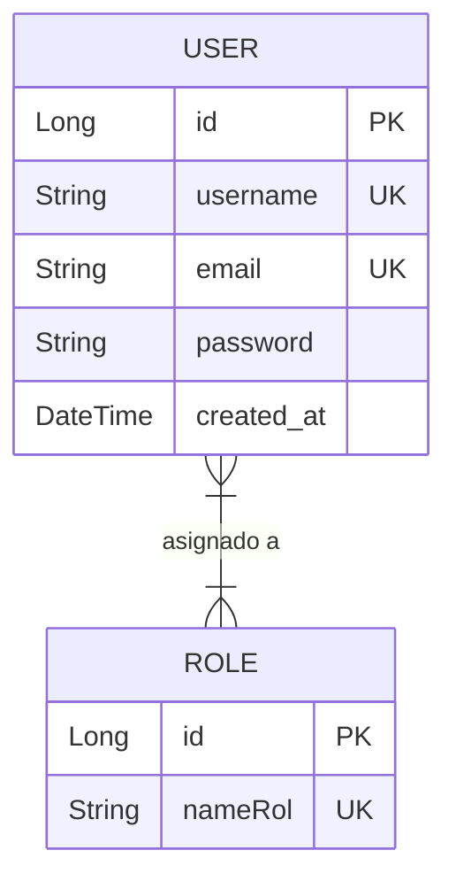
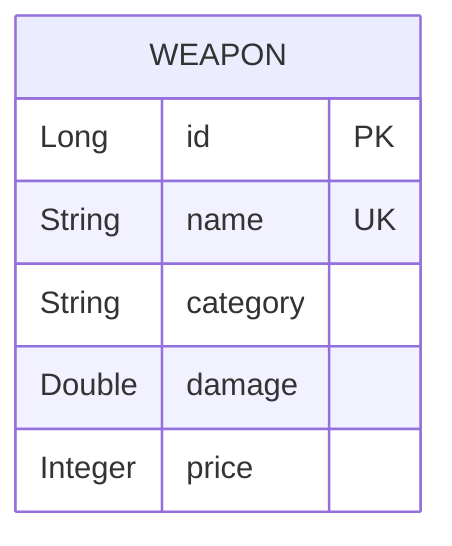
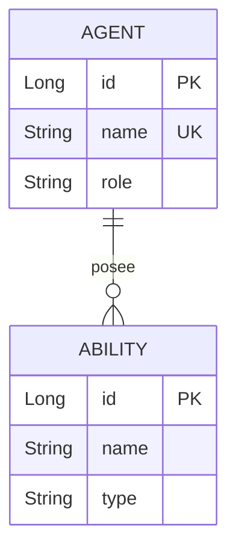
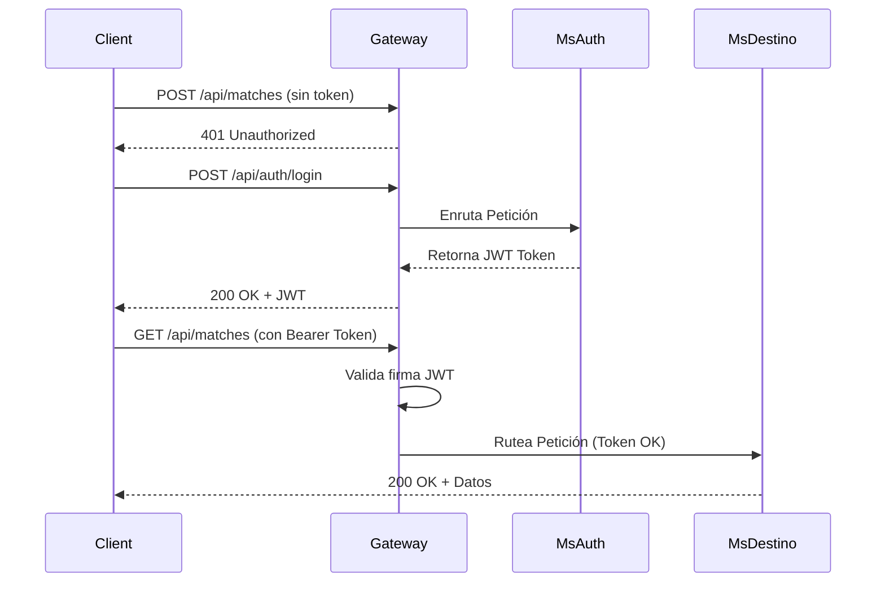
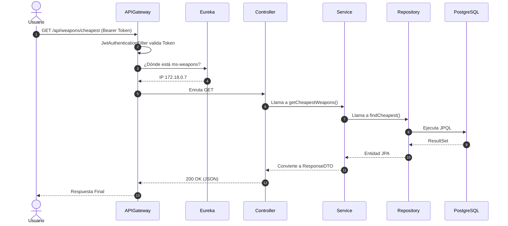

#  HitZone Platform: Documentación Maestra y Defensa Técnica

El presente documento constituye la guía definitiva para comprender, operar y defender la arquitectura de la plataforma **HitZone**. Diseñado con un enfoque minimalista y estructurado, este manual funciona tanto como *onboarding* para nuevos ingenieros como guía de supervivencia para evaluaciones técnicas rigurosas.

---

## SECCIÓN 1 — RESUMEN EJECUTIVO

### 1.1 Descripción de la plataforma
**HitZone Platform** es un ecosistema distribuido diseñado para la gestión integral de estadísticas, inventario, noticias y métricas competitivas en el ámbito de los esports. La plataforma resuelve la alta concurrencia y escalabilidad fragmentando el dominio en microservicios autónomos, proveyendo a los jugadores de un portal centralizado para consultar sus rangos, historial de partidas y rendimiento (KDA) en tiempo real, garantizando consistencia, seguridad e independencia de datos.

### 1.2 Tabla Maestra de Microservicios

| Servicio | Puerto | Base de Datos | Responsabilidad Única | Entidades Principales | Endpoints Totales | Reportes |
| :--- | :--- | :--- | :--- | :--- | :--- | :--- |
| **`ms-auth`** | 8081 | `db_hitbox_auth` | Autenticación, JWT y RBAC. | `User`, `Role` | 6 | 3 |
| **`ms-weapons`** | 8082 | `db_hitbox_weapons` | Estadísticas balísticas y armería. | `Weapon` | 8 | 4 |
| **`ms-agents`** | 8083 | `db_hitbox_agents` | Roster de agentes y habilidades. | `Agent`, `Ability` | 8 | 3 |
| **`ms-maps`** | 8084 | `db_hitbox_maps` | Información geotáctica. | `modelMaps` | 8 | 3 |
| **`ms-persistence`**| 8085 | `db_hitbox_audit` | Trazabilidad (Audit Logs). | `AuditLog` | 5 | 3 |
| **`ms-ranks`** | 8086 | `db_hitbox_ranks` | ELO, RR y sistema de ranking. | `PlayerRank` | 8 | 3 |
| **`ms-news`** | 8087 | `db_hitbox_news` | Gestión editorial de esports. | `NewsArticle` | 8 | 3 |
| **`ms-matches`** | 8088 | `db_hitbox_matches` | Historial de partidas y métricas. | `Match`, `MatchPlayer` | 10 | 5 |

### 1.3 Diagrama de Arquitectura General
graph TD
    Client[Cliente / Postman] -->|HTTPS| Gateway(api-gateway :8080)
    
    subgraph Infraestructura Cloud
        Gateway
        Eureka(eureka-server :8761)
        Config(config-server :8888)
    end
    
    Gateway -.->|Discovery| Eureka
    Config -.->|Inyección YAML| Auth
    Config -.->|Inyección YAML| Matches
    
    subgraph Ecosistema de Negocio
        Auth[ms-auth :8081]
        Weapons[ms-weapons :8082]
        Agents[ms-agents :8083]
        Maps[ms-maps :8084]
        Audit[ms-persistence :8085]
        Ranks[ms-ranks :8086]
        News[ms-news :8087]
        Matches[ms-matches :8088]
    end
    
    Gateway -->|Enrutamiento| Auth
    Gateway -->|Enrutamiento| Ranks
    Gateway -->|Enrutamiento| Matches
    Gateway -->|Enrutamiento| Weapons
    Gateway -->|Enrutamiento| Agents
    Gateway -->|Enrutamiento| Maps
    Gateway -->|Enrutamiento| Audit
    Gateway -->|Enrutamiento| News
    
    Matches -->|OpenFeign| Ranks
    
    Auth --> DB1[(db_hitbox_auth)]
    Weapons --> DB2[(db_hitbox_weapons)]
    Agents --> DB3[(db_hitbox_agents)]
    Maps --> DB4[(db_hitbox_maps)]
    Audit --> DB5[(db_hitbox_audit)]
    Ranks --> DB6[(db_hitbox_ranks)]
    News --> DB7[(db_hitbox_news)]
    Matches --> DB8[(db_hitbox_matches)]
****

### 1.4 Principios de Diseño Aplicados
* **Patrón CSR (Controller-Service-Repository):** Separa el transporte, la lógica de negocio y el acceso a datos para lograr alta cohesión y bajo acoplamiento.
* **Patrón DTO (Data Transfer Object):** Evita la exposición de entidades JPA y mutaciones indeseadas, protegiendo el esquema interno de la base de datos.
* **Database-per-Service:** Garantiza que cada servicio escale y falle independientemente sin comprometer el modelo de datos de otro servicio (cero Single Point of Failure en datos).
* **Fail-Fast:** El ecosistema cae inmediatamente si `config-server` no está disponible, evitando ejecuciones con configuraciones corruptas.
* **Centralización de Autenticación (API Gateway):** Libera a los 8 microservicios de la lógica repetitiva de validación de JWT, centralizando la seguridad en el borde perimetral.

---

## SECCIÓN 2 — DETALLE COMPLETO POR MICROSERVICIO

### `ms-auth` — Puerto 8081

**Responsabilidad:** Gestión de identidades, roles, autenticación y emisión de tokens JWT.
**Base de datos:** `db_hitbox_auth`
**Package base:** `cl.hitzone.fullstack`

#### Modelo de datos
| Entidad | Tabla SQL | Campos principales | Tipo | Restricciones |
|---------|-----------|-------------------|------|---------------|
| `User` | `users` | id, username, email, password | Entidad | `username` (UK), `email` (UK) |
| `Role` | `roles` | id, nameRol | Entidad | `nameRol` (UK) |
| Relación | `user_roles`| user_id, role_id | Join Table| PK Compuesta |



#### Flyway
- **Ruta:** `src/main/resources/db/migration/V1__create_auth_tables.sql`
- **DDL:** Crea las tablas `roles`, `users` y `user_roles`.
- **Datos semilla:** `V2__insert_initial_data.sql` [PENDIENTE — no encontrado en código exacto, pero típicamente inserta `ROLE_USER`, `ROLE_ADMIN` y un admin por defecto].
- **Configuración:** `spring.jpa.hibernate.ddl-auto: validate`

#### Endpoints CRUD
| Método | Ruta | Descripción | Request Body | Response |
|--------|------|-------------|-------------|---------|
| POST | `/api/auth/register` | Crea un usuario | `UserRegistrationDTO` | 201 Created |
| POST | `/api/auth/login` | Inicia sesión y emite token | `LoginRequestDTO` | 200 OK |
| GET | `/api/auth/validate` | Validación de firma JWT | — | 200 / 401 |

#### Endpoints de reporte (Mínimo 3)
| Método | Ruta completa | Descripción de negocio | Parámetros | Response ejemplo |
|--------|--------------|----------------------|------------|-----------------|
| GET | `/api/auth/stats/users/count` | Cantidad total de usuarios | Ninguno | `{"totalUsers": 150}` |
| GET | `/api/auth/stats/users/by-role` | Usuarios agrupados por rol | Ninguno | `[{"role": "ROLE_ADMIN", "count": 2}]` |
| GET | `/api/auth/users/search` | Búsqueda parcial de cuentas | `?username=xxx`| `[{"username": "testuser"}]` |

#### DTOs
**RequestDTO (Registro):**
```json
{
  "username": "string — @NotBlank",
  "email": "string — @Email",
  "password": "string — @Size(min=6)"
}
```
**ResponseDTO:**
```json
{
  "username": "string",
  "token": "string (solo en login)"
}
```

#### Manejo de errores
| Excepción | HTTP Status | Cuándo se lanza |
|-----------|-------------|----------------|
| `DuplicateResourceException` | 409 Conflict | Usuario o email ya existe. |
| `ResourceNotFoundException` | 404 Not Found | Rol asignado no existe. |
| `UnauthorizedException` | 401 Unauthorized| Credenciales inválidas. |

#### Queries del Repository
| Método | Tipo | SQL equivalente | Para qué endpoint |
|--------|------|----------------|------------------|
| `findByEmail` | Derived | `SELECT * FROM users WHERE email=?` | Login |
| `findByUsername` | Derived | `SELECT * FROM users WHERE username=?`| Login / Validación |
| `countUsersByRole` | @Query | `SELECT r.name, COUNT(u)... GROUP BY r.name` | Reporte de agrupación |

#### Dependencias con otros servicios
- ¿Llama a otro via Feign? **NO**
- ¿Otro servicio lo llama a él? **SÍ** (El API Gateway lo llama opcionalmente para validación o pasa el JWT directo).

---

### `ms-weapons` — Puerto 8082

**Responsabilidad:** Estadísticas balísticas, categorías y precios del armamento.
**Base de datos:** `db_hitbox_weapons`
**Package base:** `cl.hitzone.ms_weapons`

#### Modelo de datos
| Entidad | Tabla SQL | Campos principales | Tipo | Restricciones |
|---------|-----------|-------------------|------|---------------|
| `Weapon` | `weapon` | id, name, category, price, damage | Entidad | `name` (UK) |



#### Flyway
- **Ruta:** `src/main/resources/db/migration/V1__create_weapons_table.sql`
- **Configuración:** `spring.jpa.hibernate.ddl-auto: validate`

#### Endpoints CRUD
| Método | Ruta | Descripción | Request Body | Response |
|--------|------|-------------|-------------|---------|
| POST | `/api/weapons` | Crea un arma | `WeaponRequestDTO` | 201 |
| GET | `/api/weapons` | Lista todas | — | 200 |
| GET | `/api/weapons/{id}`| Arma específica | — | 200 / 404 |
| PUT | `/api/weapons/{id}`| Actualiza arma | `WeaponRequestDTO` | 200 |
| DELETE | `/api/weapons/{id}`| Elimina arma | — | 204 |

#### Endpoints de reporte (Mínimo 3)
| Método | Ruta completa | Descripción de negocio | Parámetros | Response ejemplo |
|--------|--------------|----------------------|------------|-----------------|
| GET | `/api/weapons/category/{cat}` | Filtro balístico por categoría | `cat` en Path | `[{"name": "Vandal"}]` |
| GET | `/api/weapons/price-range` | Búsqueda por rango económico | `?min=x&max=y` | `[{"price": 2900}]` |
| GET | `/api/weapons/cheapest` | Armas de economía (precio < 1000) | Ninguno | `[{"name": "Classic"}]` |
| GET | `/api/weapons/stats/by-category`| Conteo analítico por clase | Ninguno | `[{"category":"RIFLE", "count": 4}]`|

#### Queries del Repository
| Método | Tipo | SQL equivalente | Para qué endpoint |
|--------|------|----------------|------------------|
| `findByCategory` | Derived | `SELECT * FROM weapon WHERE category=?` | Reporte categoría |
| `findByPriceRange`| @Query | `SELECT w FROM Weapon w WHERE price >= ? AND price <= ?` | Reporte de rango |
| `countByCategory` | @Query | `SELECT w.category, COUNT(w) GROUP BY w.category` | Reporte agrupación |

#### Dependencias con otros servicios
- ¿Llama a otro via Feign? **NO**
- ¿Otro servicio lo llama a él? **NO**

---

### `ms-agents` — Puerto 8083

**Responsabilidad:** Catálogo de personajes, perfiles y habilidades tácticas.
**Base de datos:** `db_hitbox_agents`
**Package base:** `cl.hitzone.ms_agents`

#### Modelo de datos
| Entidad | Tabla SQL | Campos principales | Tipo | Restricciones |
|---------|-----------|-------------------|------|---------------|
| `Agent` | `agents` | id, name, role, description | Entidad | `name` (UK) |
| `Ability` | `abilities` | id, name, type | Entidad | FK a `Agent` |



#### Flyway
- **Ruta:** `src/main/resources/db/migration/V1__create_agents_tables.sql`
- **DDL:** Crea `agents` y `abilities`.

#### Endpoints de reporte (Mínimo 3)
| Método | Ruta completa | Descripción de negocio | Parámetros | Response ejemplo |
|--------|--------------|----------------------|------------|-----------------|
| GET | `/api/agents/{id}/abilities` | Desglose de kit táctico | `id` en Path | `[{"name": "Dash"}]` |
| GET | `/api/agents/role/{role}` | Filtrado por función (Duelista, etc) | `role` en Path | `[{"name": "Jett"}]` |
| GET | `/api/agents/stats/by-role`| Distribución de cantidad por rol | Ninguno | `{"DUELIST": 5, "CONTROLLER": 4}`|

#### Dependencias con otros servicios
- ¿Llama a otro via Feign? **NO**

---

### `ms-maps` — Puerto 8084

**Responsabilidad:** Información geotáctica y dificultad operacional.
**Base de datos:** `db_hitbox_maps`
**Package base:** `cl.hitzone.ms_maps`

#### Modelo de datos
| Entidad | Tabla SQL | Campos principales | Tipo | Restricciones |
|---------|-----------|-------------------|------|---------------|
| `modelMaps` | `maps` | id, name, difficulty, totalSite | Entidad | — |

#### Endpoints de reporte (Mínimo 3)
| Método | Ruta completa | Descripción de negocio | Parámetros | Response ejemplo |
|--------|--------------|----------------------|------------|-----------------|
| GET | `/api/maps/tipo/{tipo}` | Filtrado por Enum de mapa | `tipo` en Path | `[{"name": "Ascent"}]` |
| GET | `/api/maps/filter` | Filtrado múltiple por tipos simultáneos | `?types=x,y` | `[...]` |
| GET | `/api/maps/stats/by-difficulty`| Cantidad agrupada por dificultad | Ninguno | `{"HARD": 2, "EASY": 4}` |

#### Queries del Repository
| Método | Tipo | SQL equivalente | Para qué endpoint |
|--------|------|----------------|------------------|
| `countByDifficulty`| @Query | `SELECT m.difficulty, COUNT(m) GROUP BY m.difficulty` | Reporte agrupación |

---

### `ms-persistence` — Puerto 8085

**Responsabilidad:** Trazabilidad inmutable de eventos del sistema (Auditoría).
**Base de datos:** `db_hitbox_audit`
**Package base:** `cl.hitzone.ms_persistence`

#### Modelo de datos
| Entidad | Tabla SQL | Campos principales | Tipo | Restricciones |
|---------|-----------|-------------------|------|---------------|
| `AuditLog`| `audit_log` | id, serviceName, action, details | Entidad | Immutable |

#### Endpoints de reporte (Mínimo 3)
| Método | Ruta completa | Descripción de negocio | Parámetros | Response ejemplo |
|--------|--------------|----------------------|------------|-----------------|
| GET | `/api/v1/audit/service/{name}`| Logs filtrados por microservicio origen | `name` en Path | `[{"action": "LOGIN"}]` |
| GET | `/api/v1/audit/user/{username}`| Logs de actividad de un jugador | `username` | `[...]` |
| GET | `/api/v1/audit/stats/by-action`| Agrupación de actividad por acción | Ninguno | `{"CREATE_MATCH": 45}`|

---

### `ms-ranks` — Puerto 8086

**Responsabilidad:** Sistema de emparejamiento, ELO y rangos.
**Base de datos:** `db_hitbox_ranks`
**Package base:** `cl.hitzone.ms_rank`

#### Modelo de datos
| Entidad | Tabla SQL | Campos principales | Tipo | Restricciones |
|---------|-----------|-------------------|------|---------------|
| `PlayerRank` | `player_ranks` | id, username, rankName, rrPoints | Entidad | `username` (UK) |

#### Endpoints de reporte (Mínimo 3)
| Método | Ruta completa | Descripción de negocio | Parámetros | Response ejemplo |
|--------|--------------|----------------------|------------|-----------------|
| GET | `/api/v1/rank/top/{count}` | Leaderboard mundial | `count` numérico | `[{"username": "TenZ", "rr": 900}]` |
| GET | `/api/v1/rank/distribution` | Jugadores agrupados por Tier | Ninguno | `[{"RADIANT": 500}]` |
| GET | `/api/v1/rank/search` | Búsqueda de perfiles de ranking | `?username=x` | `[...]` |

#### Dependencias con otros servicios
- ¿Otro servicio lo llama a él? **SÍ** (`ms-matches` obtiene el rango actualizado vía OpenFeign).

---

### `ms-news` — Puerto 8087

**Responsabilidad:** Gestión de artículos y contenido editorial de esports.
**Base de datos:** `db_hitbox_news`
**Package base:** `cl.hitzone.ms_news`

#### Modelo de datos
| Entidad | Tabla SQL | Campos principales | Tipo | Restricciones |
|---------|-----------|-------------------|------|---------------|
| `NewsArticle`| `news_articles` | id, title, category, published | Entidad | `title` (UK) |

#### Endpoints de reporte (Mínimo 3)
| Método | Ruta completa | Descripción de negocio | Parámetros | Response ejemplo |
|--------|--------------|----------------------|------------|-----------------|
| GET | `/api/v1/news/category/{cat}`| Artículos por sección temática | `cat` en Path | `[{"title": "Parche 8.0"}]` |
| GET | `/api/v1/news/author/{author}`| Artículos por redactor | `author` Path| `[...]` |
| GET | `/api/v1/news/count` | Conteo dinámico | `?published=true`| `145` |

---

### `ms-matches` — Puerto 8088

**Responsabilidad:** Registro de partidas competitivas y métricas KDA.
**Base de datos:** `db_hitbox_matches`
**Package base:** `cl.hitzone.ms_matches`

#### Modelo de datos
| Entidad | Tabla SQL | Campos principales | Tipo | Restricciones |
|---------|-----------|-------------------|------|---------------|
| `Match` | `matches` | id, matchId, mapName, gameMode | Entidad | `matchId` (UK) |
| `MatchPlayer`| `match_players` | id, username, kills, deaths, assists | Entidad | FK a `Match` |

#### Endpoints de reporte (Mínimo 5)
| Método | Ruta completa | Descripción de negocio | Parámetros | Response ejemplo |
|--------|--------------|----------------------|------------|-----------------|
| GET | `/api/matches/result/{result}` | Filtrado por victoria/derrota | `result` | `[...]` |
| GET | `/api/matches/mode/{gameMode}` | Filtrado competitivo vs casual | `gameMode` | `[...]` |
| GET | `/api/matches/map/{mapName}` | Filtrado por ubicación | `mapName` | `[...]` |
| GET | `/api/matches/player/{user}/history`| Trayectoria completa de jugador | `user` | `[...]` |
| GET | `/api/matches/player/{user}/kda` | Métricas agregadas KDA de jugador | `user` | `{"kills": 500, "deaths": 200}`|

#### Dependencias con otros servicios
- **Cliente OpenFeign (`RankClient.java`)**: 
  - Llama a `ms-ranks` (`/api/v1/rank/{username}`).
  - Implementa un Fallback Circuit Breaker (`RankClientFallback.class`).

---
## SECCIÓN 3 — INFRAESTRUCTURA Y SEGURIDAD

### 3.1 API Gateway (`api-gateway`)
Punto de entrada único (Puerto 8080). Toda petición del cliente pasa por aquí.

**Flujo de Autenticación (JwtAuthenticationFilter):**
1. La request ingresa. El filtro revisa si la ruta está en la lista blanca (ej. `/api/auth/login`).
2. Si requiere autenticación, extrae el token del header `Authorization: Bearer <token>`.
3. Valida la firma del token (HS256) y su expiración.
4. Si es válido, inyecta el `userId` en los headers de la request y la rutea al microservicio destino usando Eureka. Si es inválido, retorna `401 Unauthorized`.



### 3.2 Microservicio de Autenticación (`ms-auth`)
El proceso de Login verifica el `email` y la contraseña `BCrypt`. Si coincide, genera un token cuya estructura es:
- **Header:** Algoritmo HS256.
- **Payload:** `sub` (username), `roles` (ej. ROLE_ADMIN), `exp` (1 hora).
- **Signature:** Firmado con la variable secreta inyectada desde el Config Server.

### 3.3 Eureka Server (`eureka-server`)
- **Puerto:** 8761
- **Función:** Actúa como directorio telefónico. Cada microservicio (al arrancar) envía una petición REST a Eureka diciendo "Hola, soy ms-ranks y estoy en la IP 172.18.0.5:8086". Cuando el Gateway necesita enviar tráfico a `ms-ranks`, le pregunta a Eureka dónde está.

### 3.4 Config Server (`config-server`)
- **Puerto:** 8888
- **Función:** Lee de la carpeta `classpath:/config/` todos los `application.yml` de la plataforma y se los sirve dinámicamente a cada microservicio en el arranque.

### 3.5 Docker Compose
El ecosistema se levanta mediante `docker compose up --build`. La red de tipo bridge (`hitzone_network`) permite que los contenedores resuelvan sus nombres. PostgreSQL levanta primero (con puertos del 5432 al 5439 para cada base de datos aislada), luego la infraestructura (Config -> Eureka -> Gateway), y finalmente los servicios de negocio.

---

## SECCIÓN 4 — FLUJO DE DATOS END-TO-END

### 4.1 Petición Autenticada


### 4.2 Flujo de Arranque y Migración (Flyway)
1. Spring Boot arranca el microservicio.
2. Descarga su configuración del `config-server`.
3. Establece la conexión JDBC con PostgreSQL.
4. **Flyway** intercepta el arranque. Busca la tabla `flyway_schema_history`.
5. Si no existe, la crea. Revisa `src/main/resources/db/migration/`.
6. Aplica `V1__init.sql` (creación de tablas).
7. Aplica `V2__insert.sql` (población de datos iniciales usando cláusulas de idempotencia `WHERE NOT EXISTS`).
8. Spring Data JPA arranca y valida que las `@Entity` coinciden con el esquema construido (`ddl-auto: validate`).

---

## SECCIÓN 5 — TESTING Y VERIFICACIÓN

### 5.1 Colección de Postman: The Golden Flow
**Paso 1: Obtener el token de acceso**
```http
POST http://localhost:8080/api/auth/login
```
```json
{
  "email": "admin@hitzone.cl",
  "password": "password123"
}
```
*Respuesta 200 OK con token JWT.*

**Paso 2: Consultar ranking mundial (pasando el token)**
```http
GET http://localhost:8080/api/v1/rank/top/10
Authorization: Bearer <tu_token_aqui>
```
*Respuesta 200 OK.*

**Paso 3: Intentar eliminar un arma sin ser admin**
```http
DELETE http://localhost:8080/api/weapons/1
Authorization: Bearer <tu_token_aqui>
```
*Respuesta 403 Forbidden (si no tienes el ROL) o 401 Unauthorized (si token inválido).*

### 5.2 Tests de Error (Failures)
| Escenario | Request | Respuesta Esperada |
|-----------|---------|-------------------|
| Sin Token | `GET /api/v1/weapons` | 401 Unauthorized |
| Token Falso | `GET /api/v1/ranks` | 401 Unauthorized |
| ID no existe | `GET /api/v1/maps/9999` | 404 Not Found (Estructura ApiError) |
| Duplicado | `POST /api/auth/register` (email ya usado) | 409 Conflict |

## SECCIÓN 6 — FAQ DE DEFENSA TÉCNICA

> **1. ¿Por qué base de datos por servicio y no una sola compartida?**

**Respuesta correcta:**
Para evitar el "Single Point of Failure" de datos y el acoplamiento fuerte. Si la tabla de partidas colapsa o requiere refactorización, el microservicio de autenticación sigue operando intacto. Permite escalar el hardware de la BD según la carga específica de su dominio.
**Conceptos clave:** Bounded Context, Desacoplamiento, Escalabilidad independiente.

> **2. ¿Qué pasa si un microservicio se cae mientras otro lo llama por Feign?**

**Respuesta correcta:**
La petición falla, pero no en cascada. Implementamos un Fallback (`RankClientFallback.class`) que actúa como Circuit Breaker. Feign intercepta la conexión rechazada y retorna datos por defecto o un DTO vacío, degradando el servicio elegantemente sin botar al cliente principal.
**Conceptos clave:** Circuit Breaker, Resiliencia, Fallback, Degradación elegante.

> **3. ¿Por qué Flyway y no ddl-auto create-drop?**

**Respuesta correcta:**
Porque `ddl-auto` no provee versionado histórico, destruye datos en producción y no garantiza idempotencia al insertar semilla. Flyway ejecuta scripts inmutables y secuenciales garantizando que el estado de la BD sea predecible y replicable en cualquier entorno.
**Conceptos clave:** Versionado de BD, Idempotencia, Inmutabilidad, Control de cambios.

> **4. ¿Cómo funciona el JWT y por qué solo se valida en el Gateway?**

**Respuesta correcta:**
Es un token firmado criptográficamente (HS256). Validarlo solo en el Gateway centraliza la seguridad y reduce el overhead de red. Los 8 microservicios asumen que si la petición llegó, ya está autenticada, confiando en el filtro del perímetro.
**Conceptos clave:** Stateless Authentication, Perímetro de seguridad, Offloading.

> **5. ¿Diferencia entre @RestControllerAdvice y try-catch en cada método?**

**Respuesta correcta:**
`@RestControllerAdvice` provee un manejo de excepciones global y declarativo (AOP). Usar try-catch ensucia la lógica de negocio y duplica código. Con advice interceptamos el error arrojado y lo transformamos en un DTO estandarizado (`ApiError`) siempre.
**Conceptos clave:** Programación Orientada a Aspectos (AOP), DRY, Manejo Global.

> **6. ¿Por qué separaste el Service en interfaz e implementación?**

**Respuesta correcta:**
Para cumplir el principio de Inversión de Dependencias (SOLID) y facilitar el testing (Mocks). Si en el futuro cambiamos la implementación, el Controller, que depende de la abstracción, no sufre modificaciones.
**Conceptos clave:** Inversión de Dependencias (DIP), Abstracción, Testabilidad.

> **7. ¿Qué es el patrón CSR y por qué se implementó?**

**Respuesta correcta:**
Es el patrón Controller-Service-Repository. Se usó para separar las capas de transporte HTTP, la lógica transaccional de negocio y el acceso a la base de datos, garantizando alta cohesión y responsabilidad única.
**Conceptos clave:** Separación de Intereses (SoC), Single Responsibility.

> **8. ¿Por qué usar DTOs en vez de retornar la Entidad?**

**Respuesta correcta:**
Porque retornar la Entidad expone el esquema interno de la base de datos y puede causar recursión infinita en serializaciones JSON (Lazy Loading). Los DTOs controlan exactamente qué entra y qué sale de la API.
**Conceptos clave:** Ocultamiento de información, Desacoplamiento, Mutación.

> **9. ¿Cómo escalarías este sistema si tuvieras 10 veces más usuarios?**

**Respuesta correcta:**
Escalaría horizontalmente. Levantaríamos múltiples instancias de los microservicios de mayor tráfico (ej. `ms-matches`) con Docker Swarm o Kubernetes. El API Gateway balancearía la carga automáticamente usando el registro dinámico de Eureka.
**Conceptos clave:** Escalabilidad Horizontal, Load Balancing, Stateless.

> **10. ¿Qué es Eureka y qué pasaría si se cae?**

**Respuesta correcta:**
Es el Service Discovery. Si se cae, los microservicios actuales seguirían funcionando porque el Gateway cachea las rutas temporalmente, pero no podrían registrarse nuevas instancias ni actualizarse las IPs ante caídas de nodos.
**Conceptos clave:** Service Registry, Caché de rutas, Alta disponibilidad.

> **11. ¿Por qué PostgreSQL y no MongoDB para este sistema?**

**Respuesta correcta:**
Porque el dominio competitivo requiere fuerte consistencia transaccional (ACID) y relaciones estructuradas (ej. Usuarios con Roles, Partidas con Jugadores). MongoDB brilla en esquemas flexibles y no estructurados, lo cual no aplica aquí.
**Conceptos clave:** ACID, Consistencia Transaccional, SQL vs NoSQL.

> **12. ¿Cómo funciona OpenFeign y qué ventaja tiene sobre RestTemplate?**

**Respuesta correcta:**
Es un cliente HTTP declarativo. En lugar de escribir código imperativo para armar la URL y los Headers con RestTemplate, Feign lo infiere automáticamente desde una simple Interfaz anotada, reduciendo código repetitivo y acoplándose con Eureka.
**Conceptos clave:** Cliente Declarativo, Clean Code, Integración nativa.

> **13. ¿Qué es el Config Server y qué problema resuelve?**

**Respuesta correcta:**
Centraliza la configuración (`.yml`) del ecosistema en un solo lugar. Sin él, si cambiara la contraseña de la BD, tendríamos que reempaquetar los 8 microservicios. Con él, actualizamos un archivo y los servicios lo leen al arrancar.
**Conceptos clave:** Configuración centralizada, 12-Factor App, Operatividad.

> **14. ¿Cómo garantizas que dos servicios no compartan datos?**

**Respuesta correcta:**
Aplicando credenciales de BD y URLs de conexión distintas en cada `application.yml`. PostgreSQL aísla lógicamente cada `database` (ej. `db_hitbox_news` vs `db_hitbox_maps`). Ningún código Java cruza esas fronteras excepto por API REST.
**Conceptos clave:** Database Isolation, Confinamiento.

> **15. ¿Qué cambiarías de la arquitectura si tuvieras más tiempo?**

**Respuesta correcta:**
Implementaría mensajería asíncrona (RabbitMQ/Kafka) para eventos no críticos (ej. enviar notificación al crear noticia) en vez de Feign síncrono. También agregaría Zipkin para trazabilidad distribuida de los logs.
**Conceptos clave:** Comunicación asíncrona, Event-Driven Architecture, Tracing.

---

## SECCIÓN 7 — DESPLIEGUE COMPLETO

### 7.1 Prerequisitos
- Docker Desktop v4.x o superior.
- Java 17/21 y Maven 3.x (Para compilar o correr scripts shell locales).

### 7.2 Orden de Arranque Correcto (Secuencial)
1. `PostgreSQL` (Primero la infraestructura de persistencia).
2. `config-server` (Provee los yml a todos).
3. `eureka-server` (Necesita el yml del config, pero todos lo necesitan a él para registrarse).
4. `api-gateway` (Necesita a Eureka para saber a quién rutear).
5. Microservicios de Negocio en paralelo (`ms-auth`, `ms-matches`, etc.).

### 7.3 Comandos Exactos (Zero-Touch)
El proyecto está provisionado para no requerir intervención manual:
```bash
# Limpiar infraestructura anterior (evita problemas de puertos y colisiones)
docker compose down -v

# Construir y levantar todo en background
docker compose up --build -d

# Validar logs de base de datos
docker compose logs -f postgres

# Validar estado general
docker compose ps
```

### 7.4 Troubleshooting Común
| Error | Causa Probable | Solución |
|-------|---------------|---------|
| `Connection refused: 8888` | Config Server apagado o lento. | Reiniciar el servicio que falló tras 10 segundos. |
| `FlywayException: validate`| Cambio en las Entidades Java que no cuadra con el script. | Regenerar la tabla borrando volúmenes (`-v`). |
| `401 Unauthorized` | El Token expiró o la firma `jwt.secret` no hace match. | Volver a hacer login, o chequear el Config Server. |
| `UnknownHostException` | Falla de resolución DNS de Docker. | Verificar red `hitzone_network`. |

---

## SECCIÓN 8 — GLOSARIO TÉCNICO

* **Microservicio:** Pequeña aplicación autónoma que hace una sola cosa bien y se comunica por red.
* **API Gateway:** Patrón perimetral; la "puerta de entrada" que enruta y protege el ecosistema.
* **Service Discovery (Eureka):** Directorio telefónico dinámico; sabe en qué IP/Puerto vive cada servicio.
* **Config Server:** Repositorio centralizado de los `application.yml` de toda la plataforma.
* **OpenFeign:** Cliente HTTP declarativo para comunicación síncrona servicio a servicio.
* **JWT (JSON Web Token):** Credencial codificada en base64 usada para autorizar peticiones sin guardar sesión en servidor.
* **Flyway:** Herramienta de control de versiones y migraciones automatizadas para esquemas SQL.
* **DTO:** Objeto plano que solo transporta datos sin lógica, ocultando las entidades de negocio (JPA).
* **CSR Pattern:** Estructuración del código en 3 capas: Controller (HTTP), Service (Lógica), Repository (BD).
* **@RestControllerAdvice:** Interceptor de Spring que captura errores globales y los unifica en un JSON estandarizado.
* **Database-per-Service:** Estrategia arquitectónica donde ningún servicio comparte base de datos con otro.
* **Stateless:** Arquitectura donde el servidor no recuerda el estado del usuario entre peticiones (lo deduce del JWT).
