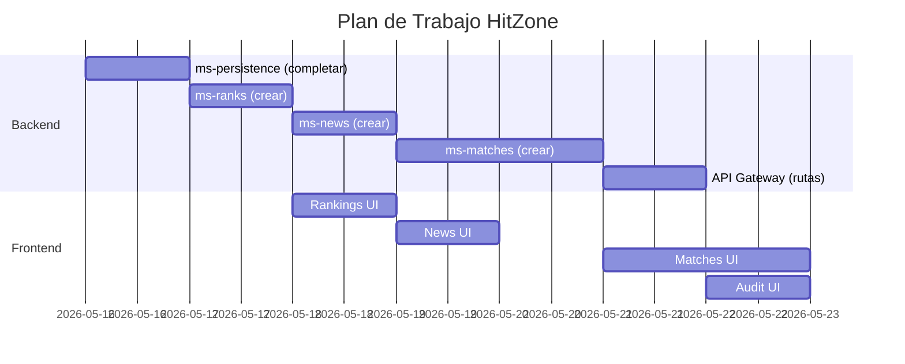

# 🎮 HitZone Platform — Plan de Trabajo Completo

> **Objetivo:** Completar la plataforma enfocándose en funcionalidades entregables, sin sobrecomplicar los microservicios pendientes.

---

## 📊 Estado Actual del Proyecto

| Microservicio | Puerto | Estado | Qué tiene |
|---|---|---|---|
| `eureka-server` | 8761 | ✅ **Completo** | Discovery service operativo |
| `config-server` | 8888 | ✅ **Completo** | Config centralizada |
| `api-gateway` | 8080 | ✅ **Completo** | Ruteo y filtros |
| `fullstack` (Auth) | 8081 | ✅ **Completo** | JWT, Users, Roles |
| `ms-weapons` | 8082 | ✅ **Completo** | CRUD Weapons, SQL |
| `ms-agents` | 8083 | ✅ **Completo** | CRUD Agents + Abilities |
| `ms-maps` | 8084 | ✅ **Completo** | CRUD Maps |
| `ms-persistence` | 8085 | 🟡 **Esqueleto** | Solo AuditLog SQL, sin código Java |
| `ms-matches` | ❓ | ❌ **Vacío** | Solo carpeta, sin POM |
| `ms-news` | ❓ | ❌ **Vacío** | Solo carpeta, sin POM |
| `ms-ranks` | ❓ | ❌ **Vacío** | Solo carpeta, sin POM |
| `frontend` | — | 🟡 **Parcial** | UI de Weapons y Agents |

---

## 🧠 Enfoque Estratégico: Pragmático y Enfocado

**El problema:** Crear `ms-matches`, `ms-news`, `ms-ranks` y `ms-persistence` desde cero con arquitectura full compleja toma semanas.

**La solución:** Implementar cada microservicio con el **mínimo viable funcional** — misma arquitectura que ya funciona en `ms-maps` y `ms-weapons`, sin reinventar la rueda.

> [!IMPORTANT]
> La referencia de implementación es `ms-maps`: tiene Entity, Repository, Service, Controller, DTOs y Flyway. **Replica ese patrón exacto en cada microservicio pendiente.**

---

## 📋 FASE 1 — Completar `ms-persistence` (Auditoría)
**Estimación: 2-3 horas**

Este microservicio ya tiene el SQL de la tabla `audit_log`. Solo falta el código Java.

### 1.1 Estructura de paquetes a crear
```
ms-persistence/src/main/java/cl/hitzone/ms_persistence/
├── model/
│   └── AuditLog.java              ← @Entity mapeada a audit_log
├── repository/
│   └── AuditLogRepository.java    ← extends JpaRepository<AuditLog, Long>
├── dto/
│   ├── AuditLogRequestDTO.java    ← Para recibir logs entrantes
│   └── AuditLogResponseDTO.java   ← Para devolver al frontend
├── service/
│   └── AuditLogService.java       ← Lógica: guardar, buscar por servicio/usuario
└── controller/
    └── AuditLogController.java    ← REST endpoints
```

### 1.2 Endpoints a implementar
| Método | Ruta | Descripción |
|---|---|---|
| `POST` | `/api/v1/audit` | Registrar un evento de auditoría |
| `GET` | `/api/v1/audit` | Listar todos los logs |
| `GET` | `/api/v1/audit/service/{name}` | Logs filtrados por microservicio |
| `GET` | `/api/v1/audit/user/{username}` | Logs filtrados por usuario |

### 1.3 Corrección de `application.yml`
- Cambiar la URL de BD a: `jdbc:postgresql://localhost:5432/db_hitbox_audit`
- Crear esa base de datos en PostgreSQL

---

## 📋 FASE 2 — Crear `ms-ranks` (Rankings de Jugadores)
**Estimación: 3-4 horas**

Es el microservicio más sencillo de los 3 vacíos. Guarda posiciones/rangos.

### 2.1 Crear el proyecto Spring Boot
- Puerto: **8086**
- Dependencias: `spring-boot-starter-data-jpa`, `spring-boot-starter-web`, `postgresql`, `lombok`, `flyway`, `eureka-client`, `config`
- Copiar la estructura de `pom.xml` de `ms-maps` y ajustar `artifactId`

### 2.2 SQL Flyway — `V1__create_ranks_table.sql`
```sql
CREATE TABLE IF NOT EXISTS player_ranks (
    id          BIGSERIAL PRIMARY KEY,
    username    VARCHAR(100) NOT NULL UNIQUE,
    rank_name   VARCHAR(50)  NOT NULL DEFAULT 'IRON',
    rank_number INT          NOT NULL DEFAULT 1,
    rr_points   INT          NOT NULL DEFAULT 0,
    wins        INT          NOT NULL DEFAULT 0,
    losses      INT          NOT NULL DEFAULT 0,
    updated_at  TIMESTAMP    DEFAULT NOW()
);
```

### 2.3 Estructura de paquetes
```
ms-ranks/src/main/java/cl/hitzone/ms_ranks/
├── model/
│   └── PlayerRank.java
├── repository/
│   └── PlayerRankRepository.java
├── dto/
│   ├── PlayerRankRequestDTO.java
│   └── PlayerRankResponseDTO.java
├── service/
│   └── PlayerRankService.java
└── controller/
    └── PlayerRankController.java
```

### 2.4 Endpoints a implementar
| Método | Ruta | Descripción |
|---|---|---|
| `GET` | `/api/v1/ranks` | Leaderboard completo ordenado por RR |
| `GET` | `/api/v1/ranks/{username}` | Rango de un jugador específico |
| `POST` | `/api/v1/ranks` | Crear/registrar jugador |
| `PUT` | `/api/v1/ranks/{username}` | Actualizar puntos RR |
| `DELETE` | `/api/v1/ranks/{username}` | Eliminar jugador |

### 2.5 Lógica de negocio especial
En `PlayerRankService`, al actualizar RR points, **calcular automáticamente** el `rank_name`:
```
0–99    → IRON
100–199 → BRONZE
200–399 → SILVER
400–599 → GOLD
600–799 → PLATINUM
800–999 → DIAMOND
1000+   → RADIANT
```

---

## 📋 FASE 3 — Crear `ms-news` (Noticias/Parches)
**Estimación: 3-4 horas**

Microservicio para gestionar artículos de noticias o notas de parche del juego.

### 3.1 Crear el proyecto Spring Boot
- Puerto: **8087**
- Mismas dependencias que `ms-ranks`

### 3.2 SQL Flyway — `V1__create_news_table.sql`
```sql
CREATE TABLE IF NOT EXISTS news_articles (
    id           BIGSERIAL PRIMARY KEY,
    title        VARCHAR(255) NOT NULL,
    summary      TEXT,
    content      TEXT         NOT NULL,
    category     VARCHAR(50)  NOT NULL DEFAULT 'GENERAL',
    author       VARCHAR(100),
    image_url    VARCHAR(500),
    published    BOOLEAN      DEFAULT FALSE,
    created_at   TIMESTAMP    DEFAULT NOW(),
    updated_at   TIMESTAMP    DEFAULT NOW()
);

CREATE INDEX IF NOT EXISTS idx_news_category   ON news_articles (category);
CREATE INDEX IF NOT EXISTS idx_news_published  ON news_articles (published);
CREATE INDEX IF NOT EXISTS idx_news_created_at ON news_articles (created_at DESC);
```

### 3.3 Estructura de paquetes
```
ms-news/src/main/java/cl/hitzone/ms_news/
├── model/
│   └── NewsArticle.java
├── repository/
│   └── NewsArticleRepository.java
├── dto/
│   ├── NewsArticleRequestDTO.java
│   └── NewsArticleResponseDTO.java
├── service/
│   └── NewsArticleService.java
└── controller/
    └── NewsArticleController.java
```

### 3.4 Endpoints a implementar
| Método | Ruta | Descripción |
|---|---|---|
| `GET` | `/api/v1/news` | Listar todas las noticias publicadas |
| `GET` | `/api/v1/news/{id}` | Detalle de una noticia |
| `GET` | `/api/v1/news/category/{cat}` | Filtrar por categoría |
| `POST` | `/api/v1/news` | Crear artículo (admin) |
| `PUT` | `/api/v1/news/{id}` | Editar artículo |
| `DELETE` | `/api/v1/news/{id}` | Eliminar artículo |

---

## 📋 FASE 4 — Crear `ms-matches` (Historial de Partidas)
**Estimación: 4-5 horas** *(el más complejo de los pendientes)*

Registra el historial de partidas jugadas por usuario.

### 4.1 Crear el proyecto Spring Boot
- Puerto: **8088**
- Mismas dependencias base

### 4.2 SQL Flyway — `V1__create_matches_table.sql`
```sql
CREATE TABLE IF NOT EXISTS matches (
    id          BIGSERIAL PRIMARY KEY,
    match_id    VARCHAR(100) NOT NULL UNIQUE,
    map_name    VARCHAR(100),
    game_mode   VARCHAR(50)  NOT NULL DEFAULT 'COMPETITIVE',
    result      VARCHAR(10)  NOT NULL,   -- WIN / LOSS / DRAW
    score_team  INT,
    score_enemy INT,
    duration_s  INT,
    played_at   TIMESTAMP    DEFAULT NOW()
);

CREATE TABLE IF NOT EXISTS match_players (
    id          BIGSERIAL PRIMARY KEY,
    match_id    BIGINT       NOT NULL,
    username    VARCHAR(100) NOT NULL,
    agent_name  VARCHAR(100),
    kills       INT          DEFAULT 0,
    deaths      INT          DEFAULT 0,
    assists     INT          DEFAULT 0,
    rr_change   INT          DEFAULT 0,
    CONSTRAINT fk_mp_match FOREIGN KEY (match_id)
        REFERENCES matches (id) ON DELETE CASCADE
);

CREATE INDEX IF NOT EXISTS idx_mp_username ON match_players (username);
CREATE INDEX IF NOT EXISTS idx_mp_match    ON match_players (match_id);
```

### 4.3 Estructura de paquetes
```
ms-matches/src/main/java/cl/hitzone/ms_matches/
├── model/
│   ├── Match.java              ← @Entity de matches
│   └── MatchPlayer.java        ← @Entity de match_players (@ManyToOne a Match)
├── repository/
│   ├── MatchRepository.java
│   └── MatchPlayerRepository.java
├── dto/
│   ├── MatchRequestDTO.java
│   ├── MatchResponseDTO.java
│   └── MatchPlayerDTO.java
├── service/
│   └── MatchService.java
└── controller/
    └── MatchController.java
```

### 4.4 Endpoints a implementar
| Método | Ruta | Descripción |
|---|---|---|
| `GET` | `/api/v1/matches` | Listar todas las partidas |
| `GET` | `/api/v1/matches/{id}` | Detalle de partida + jugadores |
| `GET` | `/api/v1/matches/player/{username}` | Historial de un jugador |
| `POST` | `/api/v1/matches` | Registrar nueva partida |
| `DELETE` | `/api/v1/matches/{id}` | Eliminar partida |

---

## 📋 FASE 5 — Actualizar API Gateway
**Estimación: 30 minutos**

Agregar las rutas de los nuevos microservicios al `application.yml` del gateway.

```yaml
# Agregar estas rutas:
- id: ms-persistence
  uri: lb://ms-persistence
  predicates:
    - Path=/api/v1/audit/**

- id: ms-ranks
  uri: lb://ms-ranks
  predicates:
    - Path=/api/v1/ranks/**

- id: ms-news
  uri: lb://ms-news
  predicates:
    - Path=/api/v1/news/**

- id: ms-matches
  uri: lb://ms-matches
  predicates:
    - Path=/api/v1/matches/**
```

---

## 📋 FASE 6 — Completar el Frontend
**Estimación: 6-8 horas**

Extender la UI existente con vistas para los nuevos microservicios.

### 6.1 Páginas a crear
| Página | Microservicio consumido | Descripción |
|---|---|---|
| `/ranks` | `ms-ranks` | Tabla de leaderboard con rangos y colores |
| `/news` | `ms-news` | Feed de noticias/parches con cards |
| `/news/:id` | `ms-news` | Vista de artículo completo |
| `/matches` | `ms-matches` | Historial de partidas del usuario |
| `/matches/:id` | `ms-matches` | Scoreboard de partida |
| `/audit` | `ms-persistence` | Vista admin de logs (protegida) |

### 6.2 Componentes reutilizables a crear
- `RankBadge` — Badge con color según rango (Iron=gris, Radiant=amarillo dorado)
- `NewsCard` — Card con imagen, categoría y resumen
- `MatchRow` — Fila de historial (WIN/LOSS coloreado, KDA, mapa)
- `ScoreBoard` — Tabla de jugadores por partida

---

## 🗺️ Orden de Ejecución Recomendado



---

## ✅ Checklist de Entrega Final

### Backend
- [ ] `ms-persistence` — AuditLog CRUD operativo
- [ ] `ms-ranks` — PlayerRank CRUD + lógica de rangos
- [ ] `ms-news` — NewsArticle CRUD + filtro por categoría
- [ ] `ms-matches` — Match + MatchPlayer con relación @ManyToOne
- [ ] API Gateway rutas actualizadas para los 4 nuevos servicios
- [ ] Todas las bases de datos creadas en PostgreSQL

### Frontend
- [ ] Página Leaderboard `/ranks`
- [ ] Página Noticias `/news` y detalle `/news/:id`
- [ ] Historial de partidas `/matches`
- [ ] Vista admin Audit `/audit` (solo ROLE_ADMIN)

### Infraestructura
- [ ] `docker-compose.yml` actualizado con los 4 nuevos servicios
- [ ] Scripts de inicio `.bat` actualizados

---

## 💡 Tips para Ir Rápido

> [!TIP]
> **Copia `ms-maps` como plantilla.** Tiene exactamente la estructura que necesitas. Solo cambia los nombres de clase, tabla y rutas. Te ahorra crear todo desde cero.

> [!TIP]
> **Empieza siempre por el SQL de Flyway.** Definir la tabla primero aclara el modelo y evita cambios de diseño a mitad de camino.

> [!NOTE]
> `ms-persistence` (auditoría) es **opcional** para el funcionamiento de la plataforma. Si el tiempo apremia, termínalo al final. La prioridad real es `ms-ranks` → `ms-news` → `ms-matches`.
